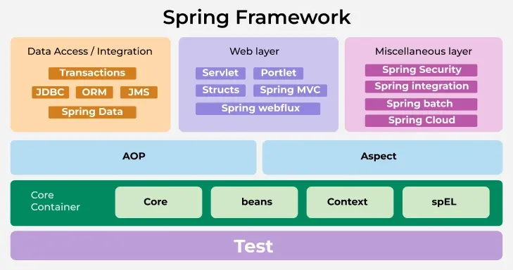

# [Spring Framework](https://github.com/spring-projects/spring-framework) Architecture
* **Modularity** -> Use only required modules.
* **Flexibility (Configuration flexibility)** -> through *XML*, *annotations*, or *Java-based setup*.
* **Integration** with *ORM tools*, *messaging systems*, *cloud services*.
* **Loose coupling** -> *Dependency injection* and *AOP*.
* **Maintainability** and **Scalability** -> supports both *monolithic* and *microservice* architecture.

## Core Principles
### 1. [Dependency Injection (DI)](https://docs.spring.io/spring-framework/reference/core/beans/introduction.html)
* Promotes **loose coupling** -> frame work handles *object creation* and *dependency management*.
* **`IoC`** container -> central part of DI
* **`BeanFactory`** provides basic DI Functionality
* **`ApplicationContext`** extends `BeanFactory` with advanced features such as:
    * Event propagation
    * Internationalization
    * Resource loading
* **The container** manages bean
    * Lifecycles
    * Scopes
        * Singleton
        * Prototype
        * Request
        * Session
    * Initialization logic
    * Destruction logic
### 2. Aspect-Oriented Programming (AOP)
* Modularization of cross-cutting concerns such as:
    * Logging
    * Transaction management
    * Security
* These concerns are separeted from bussiness logic
* **Spring AOP** defines bellow items to weave additional behavior into specific program execution points:
    * Aspects
    * Advice
    * Pointcuts

## Architecture Overview
**Independent** yet **interconnected** modules:

Developers can include only the required modules for a given project -> minimizing overhead.

### 1. Core container
#### [Spring Core Module](https://github.com/spring-projects/spring-framework/tree/main/spring-core)
* Provides the foundation of the **IoC container**.
* Manages *object creation, wiring, and configuration* through *dependency injection*.

#### [Spring Beans Module](https://github.com/spring-projects/spring-framework/tree/main/spring-beans)
* `BeanFactory` -> *creating* and *managing* bean instances.
* `BeanWrapper` -> *configuring* and *accessing* bean properties.

#### [Spring Context Module](https://github.com/spring-projects/spring-framework/tree/main/spring-context)
* `ApplicationContext` extends `BeanFactory` with enterprise-level services like:
    * Internationalization
    * Resource loading
    * Event publication
    * Annotation-based configuration

#### [Spring Expression Language (SpEL) Module](https://github.com/spring-projects/spring-framework/tree/main/spring-expression)
* Powerful ***expression language*** to ***query*** and ***manipulate*** objects at ***runtime***

### 2. Data Access/Integration
#### [Spring JDBC Module](https://github.com/spring-projects/spring-framework/tree/main/spring-jdbc)
* *Simplifies* database interactions -> eliminating boilerplate [JDBC](https://www.geeksforgeeks.org/java/introduction-to-jdbc/) code.
* *Declarative transaction management*
* *Exception translation*

#### [Spring ORM Module](https://github.com/spring-projects/spring-framework/tree/main/spring-orm)
* Integration with ORM tools like:
    * [Hibernate](https://hibernate.org/)
    * [JPA](https://www.geeksforgeeks.org/advance-java/jpa-object-relational-mapping/)
    * [MyBatis](https://mybatis.org/mybatis-3/)
* Simplifies ORM configuration.
* Consistent transaction management.

#### Spring Data
* Unified programming model for working with various data stores like:
    * Relational databases
    * NoSQL databases
    * Cloud-based databases

#### Spring Transaction
* Manages transactions
    * *Declaratively*
    * *Programmatically*
* Abstraction over Tranaction APis
* Integrates with *JDBC*, *JPA*, and [*JTA*](https://www.oracle.com/java/technologies/jta.html)

### 3. Web
#### [Spring MVC Module](https://github.com/spring-projects/spring-framework/tree/main/spring-webmvc)
* *Model-View-Controller* design pattern
* Tools for:
    * Handling HTTP requests
    * Validation
    * Data binding
* Multiple view technologies:
    * [JSP](https://www.geeksforgeeks.org/advance-java/introduction-to-jsp/)
    * [Thymeleaf](https://www.thymeleaf.org/)

#### [Spring WebFlux Module](https://github.com/spring-projects/spring-framework/tree/main/spring-webflux)
* *Reactive* and *non-blocking* web applications
* [Project Reactor](https://projectreactor.io/)
* High-throughput
* Scalable applications
* Event-driven programming

#### Spring Web Services
* *SOAP* web services
* *RESTful* web services
* *WSDL* contact-first design
* *XML-based* web service messages

### 4. Miscellaneous
#### Spring Security
* Authentication
* Authorization
* Access control
* Role-based security
* Express-based security
* OAuth2
* JWT

#### Spring Integration
* Message-driven architecture
* Event-driven architecture
* Enterprise integration patterns
* [JMS](https://www.oracle.com/java/technologies/java-message-service.html)
* [AMQP](https://en.wikipedia.org/wiki/Advanced_Message_Queuing_Protocol)
* [Kafka](https://docs.confluent.io/kafka/introduction.html)

#### Spring Batch
* Batch processing
* Reusable components
* Job scheduling
* Transaction management
* Large-volume data Handling

#### Spring Cloud
* Cloud-native microservices
* Service discovery
* Distributed configuration
* Circuit breakers
* Integration with cloud platforms.
